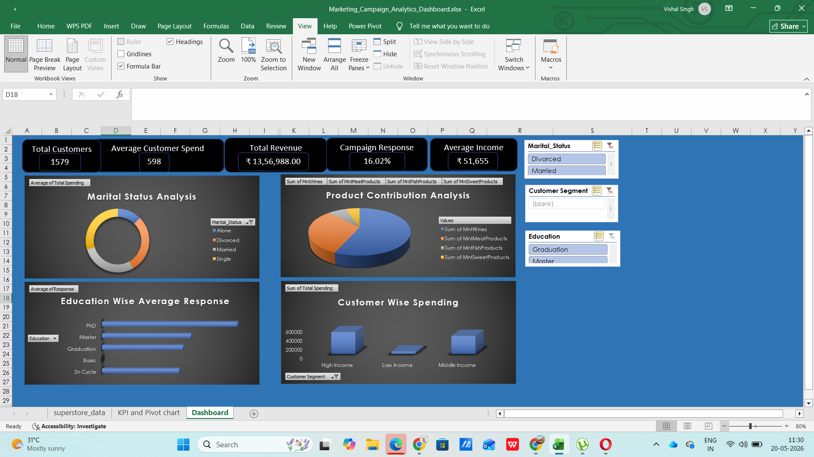
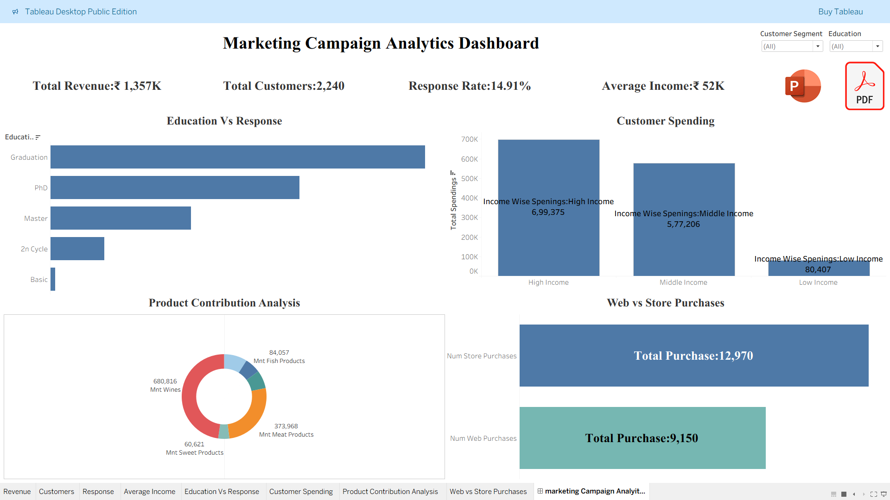

# 📢 Marketing Campaign Analytics Dashboard

### Enterprise-Grade Marketing Intelligence & Campaign Performance Analytics Platform

<p align="center">
  
  
  
  
  
</p>

---

# 📌 Executive Overview

Modern businesses run multi-channel marketing campaigns across digital platforms, generating massive volumes of customer engagement and campaign performance data daily.

This project simulates an enterprise-grade **Marketing Campaign Analytics Dashboard** designed to help organizations:

* Monitor campaign performance
* Analyze customer engagement trends
* Track marketing ROI
* Measure conversion effectiveness
* Optimize marketing spend
* Support executive-level business decisions

The solution combines **Power BI dashboards**, **SQL analytics**, **Python-based data processing**, and **marketing KPI engineering** to deliver actionable business intelligence for strategic marketing operations.

---

# 🎯 Business Problem

Marketing teams often struggle with:

* Fragmented campaign reporting
* Poor visibility into campaign ROI
* Inefficient customer engagement analysis
* Limited cross-channel performance tracking
* Delayed marketing insights
* Difficulty identifying high-performing campaigns

Traditional reporting systems fail to provide centralized and real-time marketing intelligence for strategic business growth.

This project addresses these challenges through a scalable campaign analytics framework.

---

# 💼 Key Business Objectives

✔ Monitor marketing campaign performance
✔ Analyze customer engagement behavior
✔ Track campaign ROI & conversions
✔ Improve marketing visibility
✔ Identify high-performing channels
✔ Deliver executive-ready marketing KPIs
✔ Support data-driven campaign optimization

---

# 🧠 Core Analytics Features

## 📊 Campaign Performance Analytics

* Campaign ROI analysis
* Conversion rate monitoring
* Click-through rate (CTR) tracking
* Customer engagement analysis

## 💰 Marketing Spend Intelligence

* Budget utilization analysis
* Cost-per-conversion tracking
* Channel-wise spend analysis
* Revenue attribution monitoring

## 👥 Customer Engagement Analytics

* Audience segmentation analysis
* Customer interaction trends
* Engagement pattern monitoring
* Behavioral performance insights

## 📈 Executive Reporting

* Dynamic KPI dashboards
* Marketing performance summaries
* Campaign trend analysis
* Operational business reporting

---

# 🛠 Tech Stack

| Technology        | Purpose                                       |
| ----------------- | --------------------------------------------- |
| **Power BI**      | Interactive dashboarding & business reporting |
| **Tableau**       | Advanced data visualization & storytelling    |
| **Python**        | Data preprocessing & analytical workflows     |
| **SQL**           | Marketing querying & analytics                |
| **Excel / CSV**   | Raw marketing datasets                        |
| **DAX**           | KPI calculations & business measures          |
| **Data Modeling** | Relationship management & schema optimization |

---

# 📂 Project Structure

```bash id="v3m0lk"
Marketing-Campaign-Analytics-Dashboard/
│
├── Dataset/
│   ├── campaign_data.csv
│   ├── customer_engagement.csv
│
├── Python/
│   ├── campaign_analysis.ipynb
│   ├── preprocessing.py
│
├── SQL/
│   ├── marketing_queries.sql
│
├── Dashboard/
│   ├── marketing_dashboard.pbix
│   ├── marketing_dashboard.twb
│
├── Images/
│   ├── dashboard_preview.png
│
└── README.md
```

---

# 📊 Dashboard Highlights

## Executive KPI Dashboard

* Total Campaign Revenue
* Conversion Rate
* Marketing ROI
* Customer Engagement Metrics
* Campaign Reach KPIs

## Campaign Intelligence Dashboard

* Campaign performance comparison
* Channel-wise conversion analysis
* Revenue attribution tracking
* Budget performance monitoring

## Customer Engagement Dashboard

* Audience interaction analysis
* Behavioral trend monitoring
* Engagement segmentation
* Customer conversion insights

## Marketing Operations Dashboard

* Marketing spend analysis
* Campaign trend reporting
* Platform performance benchmarking
* Operational analytics insights

---

# 🔍 Advanced Analytics

## Campaign ROI Analysis

```sql id="d2k5xt"
SELECT campaign_name,
       SUM(revenue_generated) / SUM(marketing_spend) AS roi
FROM campaign_data
GROUP BY campaign_name
ORDER BY roi DESC;
```

## Customer Engagement Analysis

```sql id="e9m7qa"
SELECT platform,
       AVG(click_through_rate) AS avg_ctr
FROM customer_engagement
GROUP BY platform
ORDER BY avg_ctr DESC;
```

---

# 🐍 Python Data Processing

## Marketing Data Preprocessing

```python id="z6q8hy"
import pandas as pd

df = pd.read_csv("campaign_data.csv")

# Handling missing values
df.fillna(0, inplace=True)

# Conversion rate calculation
df['conversion_rate'] = (
    df['conversions'] / df['total_clicks']
) * 100

# Date conversion
df['campaign_date'] = pd.to_datetime(df['campaign_date'])
```

Python was used for:

* Marketing data preprocessing
* KPI calculations
* Feature engineering
* Data transformation
* Analytical preparation workflows

---

# 📈 Quantified Business Metrics

| Metric                              | Performance                               |
| ----------------------------------- | ----------------------------------------- |
| 📢 Campaign Records Analyzed        | 100K+ campaign interaction records        |
| 💰 Marketing Spend Processed        | ₹25M+ simulated campaign budget analyzed  |
| 📊 KPI Metrics Developed            | 20+ marketing business KPIs               |
| 👥 Customer Engagement Analysis     | Multi-channel behavioral segmentation     |
| 📈 Dashboard Pages Built            | 4+ interactive executive dashboards       |
| 🧠 Analytical Queries Written       | Advanced SQL & DAX marketing calculations |
| 🚀 Data Processing Workflow         | Automated preprocessing using Python      |
| 🔍 Campaign Performance Tracking    | Centralized ROI & conversion visibility   |
| 📋 Marketing Intelligence Reporting | Enterprise-level campaign analytics       |
| ⚡ Decision Intelligence             | Faster KPI-driven marketing reporting     |

---

# 📌 Key Insights Generated

✔ Certain marketing channels consistently generated higher conversion rates
✔ Campaign ROI improved significantly with targeted audience segmentation
✔ Customer engagement trends strongly influenced conversion performance
✔ Budget allocation patterns impacted campaign effectiveness
✔ Executive dashboards enhanced marketing decision-making efficiency
✔ Centralized analytics improved cross-channel campaign visibility

---

# 🚀 Business Value

This system demonstrates how marketing analytics can:

* Improve campaign performance visibility
* Enhance customer engagement analysis
* Support data-driven marketing decisions
* Strengthen ROI monitoring workflows
* Deliver executive-level marketing intelligence
* Improve operational reporting efficiency

---

# 🏆 Skills Demonstrated

## Data Analytics

* Marketing analytics
* Campaign intelligence
* KPI engineering
* Trend analysis
* Business reporting

## Technical Skills

* Power BI
* Tableau
* Python
* SQL
* DAX
* Data modeling
* Dashboard engineering
* Marketing visualization

## Business Understanding

* Campaign performance analysis
* Customer engagement analytics
* Marketing operations
* ROI optimization
* Executive reporting

---

# 📷 Dashboard Preview

## Executive Marketing Intelligence Dashboard

> 
> 

```markdown id="pc3j9v"

```

---

# 📌 Why This Project Stands Out

Unlike generic dashboard projects, this solution demonstrates:

✅ Enterprise-style marketing analytics
✅ ROI-focused business intelligence
✅ Executive reporting architecture
✅ Strong business storytelling
✅ Production-oriented dashboard design
✅ Real-world campaign analytics use cases
✅ KPI-driven marketing intelligence framework

This project aligns closely with roles such as:

* Marketing Data Analyst
* Business Intelligence Analyst
* Campaign Analyst
* Growth Analyst
* Reporting Analyst
* Data Analyst

---

# 🔮 Future Enhancements

* Real-time campaign monitoring
* Predictive marketing analytics
* ML-based customer segmentation
* Automated marketing alerts
* API-driven campaign dashboards
* AI-powered recommendation systems
* Cloud-based analytics deployment

---

# 👨‍💻 Author

# Vishal Singh

Aspiring Data Analytics Professional specializing in:

* Marketing Analytics
* Business Intelligence
* SQL Analytics
* Executive Dashboarding
* KPI Engineering
* Data Storytelling

---

# ⭐ Support The Project

If you found this project valuable, give this repository a ⭐ to support the work and showcase appreciation.

---

# 📬 Connect With Me

* GitHub: https://github.com/vishaaaal15
* LinkedIn: https://www.linkedin.com/in/vishal-singhdataanalyst

---

# 🔥 Recruiter Snapshot

### This project demonstrates:

✔ Marketing analytics capability
✔ Executive dashboard development
✔ Campaign intelligence reporting
✔ Strong KPI engineering
✔ Enterprise-style project presentation
✔ Production-level portfolio quality
✔ Data-driven business storytelling
✔ Multi-tool analytics expertise (Power BI, Tableau, Python, SQL)

> Designed to reflect real-world marketing analytics and enterprise campaign intelligence workflows.
